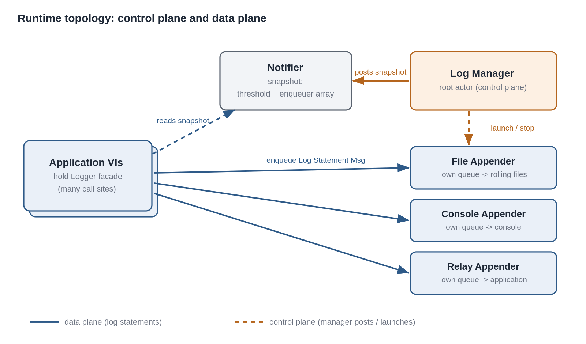
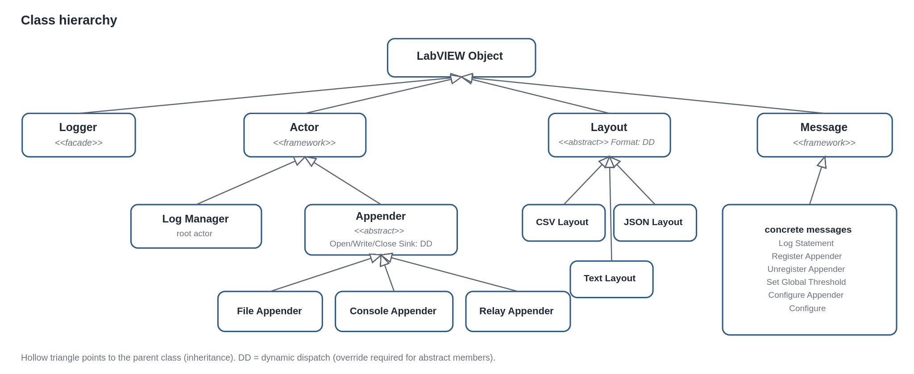
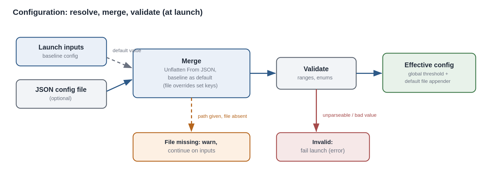
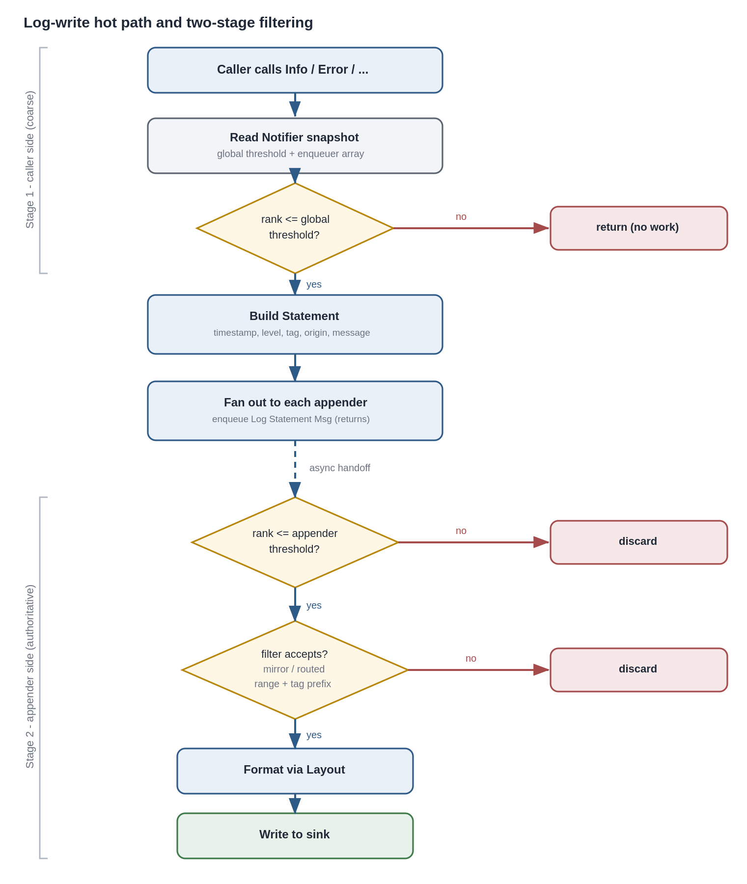
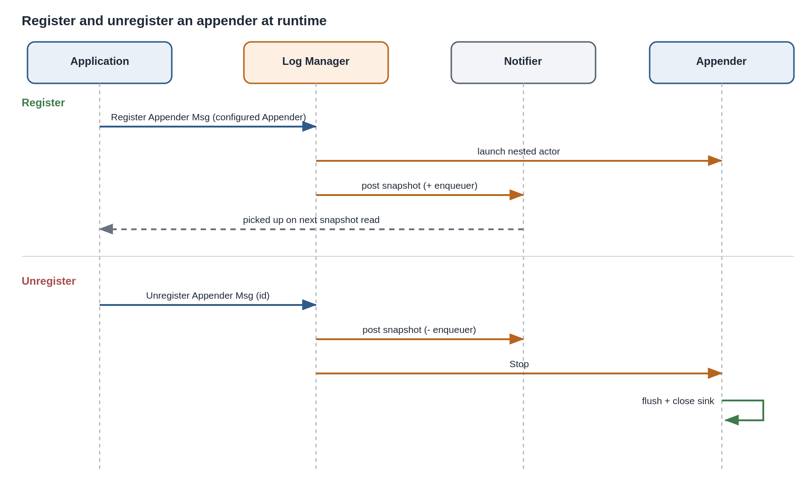
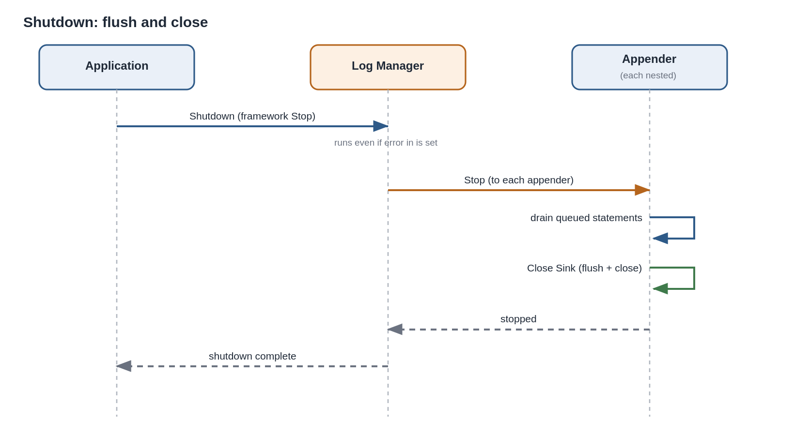

# Software Design Description: Lumberjack

**Project:** Lumberjack (Actor Framework logging library for LabVIEW)

**Companion document:** Lumberjack SRS (requirements SRS-LMBR-001 .. 064)

**Document type:** Software Design Description (SDD)

**Status:** Draft

---

## 1. Introduction

### 1.1 Purpose

This SDD describes how Lumberjack is designed to satisfy its SRS. It defines the
actor topology, class hierarchy, message catalog, initialization and runtime
dataflow, and the mechanisms for filtering, formatting, backpressure,
configuration, and Packed Project Library (PPL) safety. Where the SRS deferred a
detail to design, this document resolves it (see 9).

### 1.2 Scope

The design covers the runtime library only. Build, test, and documentation
tooling are out of scope except where they constrain the design (for example,
native JSON availability and PPL packaging).

### 1.3 Design principles

The design follows three principles drawn directly from the SRS:

- **Control plane vs data plane.** The root actor owns lifecycle and
  configuration (low frequency). The high-frequency log path does not pass
  through it. This is the central architectural decision (see 2).
- **Configuration is co-located with the actor it configures.** Each appender
  owns and validates its own configuration through its launch-time init chain
  (SRS-LMBR-029..031). The root never holds a schema of appender internals.
- **Non-blocking under all conditions.** No path blocks the caller. Under
  saturation the design drops, never blocks (SRS-LMBR-052, 058).

### 1.4 References

- Lumberjack SRS (SRS-LMBR-001 .. 064).
- NI Actor Framework documentation.
- Logger source project (predecessor).

---

## 2. Architectural Overview

### 2.1 Control plane and data plane

Lumberjack separates a low-frequency **control plane** from a high-frequency
**data plane**.

- **Control plane (message passing through the root actor):** launching and
  stopping appenders, applying configuration, registering and unregistering
  appenders. These are infrequent and are handled by messages to the root actor,
  the `LogManager`.
- **Data plane (caller-side fan-out via a shared reference):** the log-write hot
  path. A caller holds a lightweight `Logger` facade backed by a Notifier. The
  Notifier carries a read-only snapshot: the global threshold and the current
  array of appender enqueuers. A log call reads the current snapshot, applies
  the coarse global threshold locally (SRS-LMBR-012), and enqueues the statement
  directly to each appender. The root is not in this path.

The `LogManager` is the sole poster of the Notifier snapshot. It sends an
updated snapshot when the global threshold changes or the appender set changes.
Callers only read, via a non-destructive read of the current notification
(`Get Notifier Status`), which lets many caller threads read the latest snapshot
concurrently. A Notifier is chosen over a Data Value Reference here precisely
because a DVR read takes an exclusive in-place lock, serializing concurrent
readers, whereas a Notifier is built for one-to-many broadcast of a read-mostly
value. Writes are rare (control plane); reads are frequent (hot path).

This split is what lets the coarse caller-side filter of SRS-LMBR-012 work
without a round trip, and it keeps a single serialization point out of the hot
path, consistent with the async and fault-isolation requirements (SRS-LMBR-021,
052, 058).

### 2.2 Actor tree

```
Launch Root Actor
  └── LogManager  (root actor)            control plane; owns config; posts the Notifier
        ├── FileAppender (default)         nested actor; owns its file resource
        ├── FileAppender (additional)      nested actor (optional, N instances)
        ├── ConsoleAppender                nested actor (optional)
        └── RelayAppender                  nested actor (optional; taps the stream)
```

All appenders are launched as **nested actors** of the `LogManager`, so their
lifecycle is tied to it: stopping the manager stops and flushes every appender
(SRS-LMBR-002). Appenders do not know about one another; they are independent
(SRS-LMBR-018, 021, 022).

{ width=6.3in }

### 2.3 Data-plane fan-out

A single log call performs:

1. Read the current Notifier snapshot (`Get Notifier Status`, non-destructive),
   obtaining the global threshold and the appender enqueuer array.
2. If the statement's severity rank exceeds the global threshold, return
   immediately; nothing is enqueued (SRS-LMBR-012 stage 1).
3. Otherwise, build the `Statement` and enqueue a `LogStatementMsg` to each
   appender enqueuer (SRS-LMBR-019). The call then returns without waiting for
   any sink I/O (SRS-LMBR-052).

Each appender independently applies its own threshold and selection filter on
receipt (SRS-LMBR-009, 026) and writes to its sink. Because the fan-out targets
all current appenders and each filters for itself, callers never need to know
appender configuration.

### 2.4 Non-actor helper objects

Two elements are deliberately not actors:

- **`Logger` facade** (by-value class wrapping the Notifier refnum and the
  `LogManager` enqueuer). Held by callers; provides the per-level log VIs and
  the control operations. Being by-value and refnum-backed, copies are cheap and
  all share the same underlying Notifier and manager.
- **`Layout`** (by-value class). Formats a `Statement` into text. Not an actor
  because formatting is a pure, stateless transform invoked inside an appender.

**Singleton and instance access.** `Initialize` returns a `Logger` instance and
also stores it in a process-scoped location (a named single-element queue keyed
to the library). The per-level VIs take an optional `logger in`: when wired they
use that instance; when unwired they fetch the process-default from the store.
This provides Logger-style "log from anywhere without a handle" ergonomics by
default, while still supporting explicit instances (and multiple independent
loggers) for callers that wire `logger in`.

---

## 3. Class Design

### 3.1 Hierarchy

```
Actor.lvclass                         (framework)
  ├── LogManager.lvclass             root actor
  └── Appender.lvclass                abstract base for all sinks
        ├── FileAppender.lvclass
        ├── ConsoleAppender.lvclass
        └── RelayAppender.lvclass

Message.lvclass                       (framework)
  ├── LogStatementMsg.lvclass       data plane
  ├── RegisterAppenderMsg.lvclass   control plane
  ├── UnregisterAppenderMsg.lvclass control plane
  ├── SetGlobalThresholdMsg.lvclass control plane
  └── ConfigureAppenderMsg.lvclass  control plane

Layout.lvclass                        by-value, stateless
  ├── CSVLayout.lvclass              default
  ├── JSONLayout.lvclass
  └── TextLayout.lvclass

Logger.lvclass                        by-value caller facade (Notifier + managerEnqueuer)
```

`Statement` is a typedef cluster, not a class, because it is pure data passed
between the caller and the layouts (see 5.3).

{ width=6.4in }

### 3.2 Appender base class

`Appender.lvclass` private data carries the **common configuration** every
appender shares (SRS-LMBR-029):

- Appender ID (unique string).
- Level threshold (severity rank, SRS-LMBR-009).
- Selection filter: mode (mirror or routed) plus criteria (level range,
  source-tag prefix) (SRS-LMBR-026).
- Queue bound (-1 = unbounded; 0 invalid) and drop policy (SRS-LMBR-055..057).
- Dropped-statement counter (SRS-LMBR-059).
- Layout reference (SRS-LMBR-015).

`Appender.lvclass` defines dynamic-dispatch members overridden by each concrete
type:

- `OpenSink.vi` (protected) opens the type's resource during actor startup (for
  example, opens the first log file).
- `Write.vi` (protected) writes one already-formatted, already-accepted line to
  the sink.
- `CloseSink.vi` (protected) closes the resource during shutdown.
- `InitCommon.vi` sets the common private data from an `AppenderConfig`
  cluster (called by each child's init, see 4.4).

The base class implements, once, the receipt logic shared by all appenders: on a
`LogStatementMsg`, evaluate the appender threshold and selection filter; if
accepted, format via the layout and call `Write.vi`. Concrete types implement
only their sink specifics.

### 3.3 Concrete appenders

- **FileAppender** adds: root folder, maximum file size, maximum file count,
  extension, delimiter, calendar-folder-tree enable (SRS-LMBR-030, 032..040).
  `OpenSink` creates the base folder and opens the first ISO 8601-named file;
  `Write` appends a line and triggers rollover/retention (5.5).
- **ConsoleAppender** adds nothing beyond common config; `Write` prints the
  formatted line.
- **RelayAppender** adds: delivery mode (message or queue) and, for message
  mode, the application-supplied enqueuer; for queue mode, an owned LabVIEW
  queue whose reference is exposed (SRS-LMBR-023..025, 5.6).

### 3.4 Configuration clusters

LabVIEW clusters do not inherit, so the common configuration is expressed by
**composition**: a common `AppenderConfig` cluster is nested inside each
type-specific config typedef.

- `AppenderConfig` (common): ID, threshold, filter mode, filter criteria, queue
  bound, drop policy.
- `FileAppenderConfig` = `common` (`AppenderConfig`) + `file` (`FileConfig`).
- `LumberjackConfig` (top level, the JSON/inputs boundary) = { schema version,
  global threshold, default `FileAppenderConfig` }.

The actor **classes** inherit (3.1); the config **clusters** compose. The init
chain bridges the two: a child receives its config typedef, sets its own private
fields, and passes the nested `AppenderConfig` to `InitCommon.vi` (4.4).

### 3.5 Message catalog

Data plane (caller -> appender enqueuer):

| Message | Payload | Do.vi action |
|---|---|---|
| LogStatementMsg | `Statement` cluster | Base `Appender` evaluates threshold + filter; if accepted, format and `Write`. |

Control plane (caller/`Logger` -> `LogManager` enqueuer):

| Message | Payload | Do.vi action |
|---|---|---|
| RegisterAppenderMsg | a constructed, pre-configured `Appender` object | Launch it as a nested actor, add its enqueuer to the registry, post an updated Notifier snapshot. |
| UnregisterAppenderMsg | appender ID | Post an updated snapshot without that enqueuer, then send framework Stop to the appender and remove it from the registry. |
| SetGlobalThresholdMsg | threshold | Post an updated snapshot with the new threshold. |
| ConfigureAppenderMsg | appender ID + config delta | Forward as a per-appender configure message to the target appender. |

Manager -> appender (control):

| Message | Payload | Do.vi action |
|---|---|---|
| ConfigureMsg | config delta | Apply to the appender's private data (threshold/filter/backpressure/type-specific). |
| Stop (framework) | none | Flush and close the sink, then stop. |

The `Logger` facade holds both the Notifier (data plane) and the `LogManager`
enqueuer (control plane); all control operations are convenience wrappers that
enqueue the messages above.

---

## 4. Initialization, Configuration, and Launch

### 4.1 Configuration sources and precedence

Effective configuration is resolved **once, at launch** (SRS-LMBR-051), from two
sources:

1. Programmatic launch inputs: the global threshold and the default file
   appender's `FileAppenderConfig` (SRS-LMBR-044).
2. An optional JSON configuration file path (SRS-LMBR-045).

Precedence is per-setting: a value present in a valid file overrides the
matching launch input; any setting absent from the file falls back to the input
(SRS-LMBR-046).

### 4.2 JSON parse, merge, validate

The pipeline uses native JSON primitives (SRS-LMBR-061). The native config
typedefs stay native (enums, `Path`, data only); a separate string-typed DTO
mirror is the `Unflatten From JSON` target and the merge currency, and the
per-key merge falls out of the primitive itself:

1. Build the baseline **DTO** from defaults overlaid with the launch inputs.
   Because launch inputs are typed, forming the baseline uses the enum-to-name
   direction (`SeverityString` and equivalents) and renders paths as strings.
2. If a config-file path is supplied:
   - If the file is **missing**: keep the baseline, complete launch, and return
     a non-fatal warning naming the path (SRS-LMBR-047).
   - If present: pass the file text to `Unflatten From JSON` with the baseline
     DTO as the default-value input. Keys present in the file override; keys
     absent retain the baseline. This realizes SRS-LMBR-046 directly.
   - If the text cannot be parsed: fail launch with a descriptive error
     (SRS-LMBR-048).
3. Validate the merged DTO field-by-field in Lumberjack code (required keys
   present, enum names known, thresholds in range, file size/count non-negative,
   baseName/extension filename-safe, filter criteria well-formed). Native
   parsing reports only generic structural errors, so field-level validation
   lives here
   and names the offending setting (SRS-LMBR-048).
4. Map the validated DTO to the native `LumberjackConfig`: names to enums
   (`SeverityFromString`, `DropPolicyFromString`, `FilterModeFromString`), path
   strings via `String To Path`. Downstream code sees only native types.
5. A resource named by a valid config (root folder, path permissions) is not
   validated here; failure to realize it surfaces later as the appender's own
   launch error (SRS-LMBR-049).

Config carries only **data**: no class objects, refnums, or DVRs, because
`Unflatten From JSON` reconstructs a fixed value layout and cannot instantiate a
class. The `Layout` is therefore never config; the appender constructs it at
`InitCommon` from data fields (the `delimiter` feeds the default `CSVLayout`),
and programmatic injection stays a code path (`CreateFileAppender`'s optional
`layout` input). The relay consumer `Enqueuer` is handled the same way (supplied
at creation, held in private data), so the DTO mirror is a clean 1:1 of the
native config with no object fields to drop.

Enums are serialized by **member name** in the file (for example `"INFO"`,
`"DropOldest"`, `"Mirror"`), not by ordinal, so config is human-readable and
survives an enum being reordered, whereas a stored ordinal would silently remap.
This also generalizes to future INI/YAML/XML readers, which are all
string-native, so a member name drops into any of them and they converge on the
same name-to-enum lookup.

**JSON schema shape** (resolving the SRS-deferred detail, SRS-LMBR-050). The
file is a single object carrying global settings and the default file appender
only; it does not list appenders:

```json
{
  "schemaVersion": "00.00.01",
  "globalThreshold": "INFO",
  "defaultFileAppender": {
    "common": {
      "id": "default-file",
      "threshold": "INFO",
      "filter": { "mode": "Mirror" },
      "queueBound": -1,
      "dropPolicy": "DropOldest",
      "useUTC": true
    },
    "file": {
      "rootFolder": "",
      "baseName": "",
      "maxFileSize": 10485760,
      "maxFileCount": 10,
      "extension": "csv",
      "delimiter": ",",
      "calendarFolderTree": true
    }
  }
}
```

An empty `rootFolder` signals "compute the default from the host application
context" (see 6). `schemaVersion` lets the validator reject configs it does not
understand.

{ width=6.3in }

### 4.3 Launch sequence

1. `Launch Root Actor` starts the `LogManager` and returns its enqueuer,
   wrapped in a `Logger` facade along with a freshly created Notifier.
2. The `LogManager` resolves effective configuration (4.2).
3. It constructs the default `FileAppender` object, sets its configuration
   through the init chain (4.4), and launches it as a nested actor, obtaining
   its enqueuer. If the default file is disabled, this step is skipped
   (SRS-LMBR-038).
4. It posts the initial Notifier snapshot: the global threshold and the enqueuer
   array (initially the default file appender only). Posting before launch
   returns guarantees `Get Notifier Status` always has a value for callers.
5. Launch returns the `Logger` to the caller. Any non-fatal warning from 4.2
   rides out on the error wire.

Additional appenders are added afterward by the application constructing and
configuring an appender object and sending `RegisterAppenderMsg`
(SRS-LMBR-028, 031, 044).

### 4.4 Parent/child init chain

Each appender is configured at its own launch through a dynamic-dispatch init
chain (SRS-LMBR-031):

1. The application (or the manager, for the default file) calls the concrete
   type's `Init.vi` with the type-specific config typedef.
2. `Init.vi` sets the child's own private fields (for example, the file
   appender's root folder and rollover settings).
3. `Init.vi` calls the parent method `InitCommon.vi`, passing the nested
   `AppenderConfig` cluster, which sets the common private data (ID, threshold,
   filter, backpressure, layout).
4. The now-configured actor object is handed to `Launch Actor` /
   `RegisterAppenderMsg`. Resource opening happens later, in the actor's
   startup, via `OpenSink.vi`.

The root never parses or holds a concrete appender's type-specific fields; it
only moves the constructed object. Adding a new appender type is a new subclass
with no manager changes.

---

## 5. Runtime Behavior

### 5.1 Log-write hot path (sequence)

For `Logger.Info("...", optional tag)`:

1. Read the current Notifier snapshot (`Get Notifier Status`).
2. Compare INFO's rank (4) to the global threshold; if it exceeds it, return (no
   allocation, no enqueue).
3. Build the `Statement`: ISO 8601 timestamp, level name, source tag (supplied
   or defaulted, 5.3), origin VI name (from the call chain), message
   (SRS-LMBR-010, 011, 017).
4. For each enqueuer in the snapshot array, enqueue a `LogStatementMsg`.
5. Return. No sink I/O has occurred on the caller's thread (SRS-LMBR-052).

Each appender, on its own thread, dequeues the message, applies stage-2
filtering, formats, and writes (5.2, 5.4).

### 5.2 Two-stage filtering

- **Stage 1, caller side (coarse):** global threshold check before any enqueue
  (SRS-LMBR-007, 012). A global threshold of 7+ is a pass-through; 0 disables
  all logging.
- **Stage 2, appender side (authoritative):** each appender applies its own
  threshold (SRS-LMBR-009), then its selection filter (SRS-LMBR-026): mirror
  mode accepts everything above threshold; routed mode accepts a subset by level
  range and/or source-tag prefix (5.3). Only accepted statements are formatted
  and written.

Because stage 2 lives in each appender, the same statement is evaluated
independently per appender, so filtering work scales with appender count. This
is the accepted cost of full routing flexibility.

{ width=5.4in }

### 5.3 Source tag and hierarchical prefix matching

`Statement` carries both an origin VI name (physical) and a source tag
(logical), kept distinct (SRS-LMBR-010, 013).

- The tag is a dot-separated hierarchical string, log4j-style (SRS-LMBR-013).
- **Default tag (SRS-deferred detail resolved):** when the caller supplies no
  tag, it defaults to the origin VI's base name with the `.vi` extension
  stripped, and any remaining dots in that base name are replaced with
  underscores before use. This prevents a VI filename that contains dots from
  being misread as tag hierarchy, so a default tag is always a single node.
- **Prefix match (SRS-LMBR-027):** a statement tag `T` matches a configured
  prefix `P` if `T == P` or `T` begins with `P` followed by the separator `.`.
  Comparison is a plain string test; no tree is built. Example: `app.db` matches
  `app.db` and `app.db.query`, not `app.database`.

### 5.4 Layout and CSV column order

`Layout.Format(Statement) -> String` is dynamic dispatch (SRS-LMBR-015). The
default `CSVLayout` (SRS-LMBR-012) resolves the deferred column order as:

```
timestamp, level, sourceTag, originVI, message
```

The message is last because it is free text most likely to contain the
delimiter. `CSVLayout` carries its `delimiter` as private data, so any single
configured delimiter works: a comma yields CSV, a tab yields TSV, and any
other single character its own delimited variant. The column order is fixed;
only the delimiter varies. Fields are quoted per RFC 4180 against whichever
delimiter is configured: a field containing that delimiter, a double quote, or
a newline is wrapped in double quotes and internal quotes are doubled. The
default file appender's configured delimiter (SRS-LMBR-037) is applied by
constructing its `CSVLayout` with that delimiter.

### 5.5 File appender behavior

- **Naming:** each file name is an optional `baseName` prefix plus an ISO 8601
  timestamp (colons removed; UTC or local per `useUTC`), so a new file never
  overwrites a prior one and names sort chronologically (SRS-LMBR-035).
- **Rollover:** when a write would exceed `maxFileSize`, the current file is
  closed and a new timestamped file is opened; `maxFileSize = -1` disables size
  rollover (unbounded file), and `0` is invalid (SRS-LMBR-033). File names use
  second-resolution timestamps and files are opened create-only (never reopened
  or overwritten), so `maxFileSize` must be large enough that rollover cannot
  occur twice within one second; a same-second collision faults by design,
  rather than silently clobbering a log. Realistic (MB-scale) limits never
  collide; rollover tests that use tiny limits must space rollovers past one
  second.
- **Retention:** after a rollover, retention is applied per base-name series:
  within each `baseName`, the oldest files beyond the maximum count are
  deleted; a maximum of `-1` means never delete (keep all), and `0` is invalid
  (SRS-LMBR-034). Grouping by base name keeps series with different base names
  (or a shared root folder) from pruning against each other; the appender also
  lists only its own `baseName_*` files before selecting.
- **Calendar tree:** when enabled, files are placed in a dated sub-folder
  hierarchy under the root folder, based on creation date (SRS-LMBR-036).
- Each of these settings is per-instance, so multiple file appenders write to
  distinct locations with independent rules (SRS-LMBR-032, 039, 040).

### 5.6 Relay appender behavior

- **Message mode (default, SRS-LMBR-024):** each accepted statement is forwarded
  as a `LogStatementMsg` to the application-supplied enqueuer. The consumer is
  itself an actor whose inbound queue obeys the same backpressure policy as any
  appender (5.7).
- **Queue mode (compatibility, SRS-LMBR-025):** accepted statements are enqueued
  onto an owned LabVIEW queue whose reference is exposed for the application to
  Dequeue or Flush. This mode is poll-based and serves non-actor consumers; the
  consumer controls drain timing.

Because the relay is an appender, its threshold and filter apply, so a consumer
can tap only a subset (for example, ERROR and above) (SRS-LMBR-023).

### 5.7 Backpressure

- **Unbounded by default (SRS-LMBR-055):** an appender's inbound queue grows
  with memory; no loss, with documented memory-growth risk under sustained
  overload.
- **Bounded option (SRS-LMBR-056):** a per-appender maximum queue depth, the
  intended Real-Time/embedded mode, which also bounds memory and jitter.
- **Drop-oldest default (SRS-LMBR-057):** when a bounded queue is full, the
  oldest queued statement is discarded to admit the newest. Drop-newest and
  level-aware drop (never discard ERROR/FATAL) are selectable per appender.
- **No blocking (SRS-LMBR-058):** the enqueue path never blocks the caller; on a
  full bounded queue the drop policy acts immediately. This is what preserves
  SRS-LMBR-052 under saturation.
- **Loss observability (SRS-LMBR-059):** each appender keeps a dropped-statement
  counter and periodically emits a synthetic "N statements dropped" record into
  its own output so gaps are visible.

Implementation note: the drop-oldest and bound are enforced inside the appender
as it manages intake, not by blocking the framework enqueue, so the caller-side
enqueue always completes.

### 5.8 Register and unregister at runtime

- **Register (SRS-LMBR-020, 028):** the application constructs and configures an
  appender, then sends `RegisterAppenderMsg`. The manager launches it, adds
  its enqueuer to the registry, and posts an updated Notifier snapshot. Callers
  pick up the new appender on their next snapshot read.
- **Unregister (SRS-LMBR-020):** `UnregisterAppenderMsg` with an ID causes the
  manager to remove the enqueuer from the snapshot first (so callers stop
  targeting it), then send the framework Stop to that appender, which flushes
  and closes before stopping.

A statement enqueued to an appender in the brief window before its removal is
simply processed normally; a statement whose target has already stopped fails
its enqueue harmlessly and does not affect other appenders (SRS-LMBR-021).

{ width=6.3in }

### 5.9 Configuration changes vs in-flight statements (SRS-deferred detail resolved)

Runtime configuration is applied by messages, so ordering is well defined by
message order, not retroactive:

- **Global threshold:** `SetGlobalThresholdMsg` posts an updated Notifier
  snapshot. Statements evaluated by callers after that post use the new
  threshold; statements already enqueued are unaffected.
- **Per-appender config:** `ConfigureAppenderMsg` is forwarded to the target
  appender and takes effect for statements that appender dequeues after the
  configure message. Statements already ahead of it in that appender's queue are
  processed under the prior configuration.

The design makes no attempt to retroactively reclassify statements already in
flight; the boundary is the configuration message itself. This is stated so
verification can assert it.

### 5.10 Shutdown

`Logger.Shutdown` sends the framework Stop to the `LogManager`, which stops
each nested appender. Each appender, on stop, drains and writes any queued
statements, then closes its sink (SRS-LMBR-002). Shutdown completes its
flush-and-close even if a prior error is present on the wire (SRS-LMBR-004).

---

{ width=6.0in }

## 6. Path Resolution under a Packed Project Library

Lumberjack is buildable as a PPL (SRS-LMBR-063). When code runs from a PPL,
`Current VI's Path` resolves to a location inside the `.lvlibp`, which is never
the host application's directory, so the design never derives an external path
from a Lumberjack VI's own location (SRS-LMBR-064). External-path computation is
quarantined in a single VI, `ResolveHostRoot` (`src/Support/Path/`):

- If the caller supplies `host application path` at launch, that value is used
  directly (the deterministic, recommended path).
- Otherwise, running in the development system, the host root falls back to
  `Application Directory`, which reports the top-level application context, not
  the calling VI's PPL location.
- Otherwise, running as a built application (`Application.Kind = Run Time
  System`) with no host path supplied, `ResolveHostRoot` returns a fatal
  **error 5000** rather than defaulting to the executable folder, which under
  Windows UAC is often read-only (Program Files). A deployed build must supply
  an explicit, writable host path.

The file appender root folder otherwise comes from configuration or launch
inputs (SRS-LMBR-039, 044); a relative or empty root is resolved against this
host root. `ResolveHostRoot` is the only VI permitted to compute an external
base path, and it never calls `Current VI's Path`.

---

## 7. Threading and Determinism

- Each appender runs its own Actor Core loop on its own thread, so slow sink I/O
  in one appender does not delay another (SRS-LMBR-022).
- Enqueue-to-delivery latency through AF queues is not deterministic
  (SRS-LMBR-053). Lumberjack must not be a control loop's timing source.
  Determinism-sensitive callers use the bounded-queue mode (SRS-LMBR-056) to
  bound memory and jitter, and rely on the MFC/hardware or a Timed Loop for
  actual timing, not on Lumberjack delivery.
- Within one appender's queue, order is preserved (SRS-LMBR-054). Cross-appender
  order is not guaranteed once queues drain concurrently.

---

## 8. Project Structure and Packaging

### 8.1 Three orthogonal axes

Three things are independent in LabVIEW, and only one is the API boundary:

- **Disk folders** organize source by concern and by class (a `.lvclass` is a
  folder holding the class and its member VIs). Organization only.
- **Member access scope** (public, community, protected, private) is the real
  membrane: it determines what a PPL exposes to adopters, per member, regardless
  of folder.
- **The functions palette** (`.mnu` files) curates which public entry points
  adopters see and how they are grouped. Discoverability only.

The public API is therefore defined by scope plus palette, not by a single
folder. Folders exist for maintainers.

### 8.2 Folder layout

```
lumberjack/
  Lumberjack.lvproj
  README.md   LICENSE.txt
  docs/
  configs/                   Lumberjack.vipb
  src/
    Lumberjack.lvlib         the packable library
    palettes/                .mnu (see 8.4)
    Public/
      Logger.lvclass/        API facade
    Core/
      LogManager.lvclass/   root actor
      Appenders/
        Appender.lvclass/    abstract base
        FileAppender.lvclass/
        ConsoleAppender.lvclass/
        RelayAppender.lvclass/
      Layouts/
        Layout.lvclass/      abstract Format (DD)
        CSVLayout.lvclass/
        JSONLayout.lvclass/
        TextLayout.lvclass/
    Messages/                one class per message
    TypeDefs/                typedef controls
      ConfigDTO/             string DTO mirrors
    Support/                 internal helpers:
      Config/  Config/Mapping/  Enum/
      Filter/  File/  Path/
      Severity/  Store/  Tag/
  examples/
  tests/                     Unit/ Integration/ Support/
  scripts/                   Build, Build PPL, Package, Test
```

Roles and scopes are in 8.1 and the 8.3 mapping table; per-class member lists
are in the Message and Class Reference. This tree shows layout only.

### 8.3 Element-to-path mapping

| Element | Path | Scope |
|---|---|---|
| Logger facade | `src/Public/Logger.lvclass/` | public (the API) |
| LogManager | `src/Core/LogManager.lvclass/` | community |
| Appender base and concretes | `src/Core/Appender.lvclass/`, `src/Core/Appenders/` | base community; `Init` public, sink members protected |
| Layouts | `src/Core/Layouts/` | `Create` public, `Format` public DD |
| Messages | `src/Messages/` | community/private (internal transport) |
| Type definitions | `src/TypeDefs/` | public where they cross the API (Severity, config clusters, Filter); private otherwise (Snapshot) |
| Pure helpers (Severity, Enum, Tag, File, Filter) | `src/Support/Severity`, `Enum`, `Tag`, `File`, `Filter` | community (test library is a friend), off the public PPL surface |
| Config (Merge, Validate, Resolve, mappers) | `src/Support/Config`, `Config/Mapping` | community (test library is a friend), off the public PPL surface |
| Store and Path helpers | `src/Support/Store`, `Path` | private |

Two placements tie to earlier decisions: the singleton process store is isolated
in `Support/Store/` and kept private so adopters never see the default-instance
plumbing (2.4); and PPL-safe path resolution is isolated in `Support/Path/`,
which makes SRS-LMBR-064 auditable, that one folder is the only place allowed to
compute paths, and it never uses `Current VI's Path`.

### 8.4 Functions palette (.mnu)

The palette is **curated, not directory-synced.** A directory-synced palette
(`dir.mnu` listing a folder's contents) would expose internal VIs and mirror the
disk layout; instead, explicit `.mnu` files in `src/palettes/` list only public
entry points, grouped by task. The grouping mirrors Logger's palette
(Action-Status, Configure, Data, Utility), modernized with an Appenders
sub-palette, since the file `Configure` settings moved onto appender creation:

```
Lumberjack
  Action-Status:  Initialize | Trace Debug Info Warn Error Fatal | Shutdown
  Appenders:      Create File/Console/RelayAppender | Register/Unregister/ConfigureAppender
                  | MakeMirrorFilter | MakeRoutedFilter | Create CSV/JSON/TextLayout
  Configure:      ConfigureLevel | ConfigureVerbosity
  Data:           GetRelayQueue (queue-mode consumption)
  Utility:        CatchError | MaskErrors | CreateTemporaryRootFolder
```

The `.mnu` files reference public VIs only; member scope still governs
callability, so a VI omitted from the palette but left public is still callable,
and an internal VI cannot be surfaced by the palette. The VI Package build spec
(`Lumberjack.vipb`) places these `.mnu` files into the adopter's Functions
palette on install.

### 8.5 Packaging

The entire library lives under one `Lumberjack.lvlib`. `Build PPL.vi` packs it
into a single `.lvlibp`; member scope decides which members survive as callable
in the packed library (SRS-LMBR-063), and the isolated path handling (8.3,
section 6) keeps it correct when loaded from the PPL (SRS-LMBR-064).
`Package.vi` builds the VI Package, and `Build.vi` produces a plain source
distribution. The runtime has only the Actor Framework dependency and targets
LabVIEW 2014 or newer (SRS-LMBR-060, 061, 062).

---

## 9. Design Rationale Summary

- **Caller-side fan-out over a hub:** chosen to honor the caller-side coarse
  filter (SRS-LMBR-012) and to keep a single serialization point out of the hot
  path (SRS-LMBR-021, 052).
- **Notifier as the shared snapshot container:** the enqueuer list must live in
  one shared source of truth because appenders register/unregister at runtime
  (SRS-LMBR-020, 028), just as Logger held its list of listener queues in a
  global. A Notifier is used rather than a DVR because it is built for
  one-to-many broadcast with concurrent non-destructive reads, avoiding the
  exclusive read lock a DVR imposes on the hot path.
- **Composition for config clusters, inheritance for actor classes:** LabVIEW
  clusters cannot inherit; the actor classes carry the true hierarchy and the
  init chain bridges the two.
- **Native JSON with the baseline cluster as default value:** turns the per-key
  merge (SRS-LMBR-046) into a property of the primitive rather than hand-written
  merge logic.
- **Relay as an appender:** the read/tap mechanism inherits filtering and
  backpressure for free (SRS-LMBR-023).

---

## 10. Deferred Details Resolved Here

| SRS reference | Deferred detail | Resolution (section) |
|---|---|---|
| SRS-LMBR-043 | Config application vs in-flight statements | Message-ordered, non-retroactive (5.9) |
| SRS-LMBR-013 | Tag separator vs VI names containing dots | Default tag is single-node; dots in VI base name replaced with `_` (5.3) |
| SRS-LMBR-012 | CSV column order | timestamp, level, sourceTag, originVI, message; RFC 4180 quoting (5.4) |
| SRS-LMBR-050 | JSON schema shape | Single object: global settings + default file appender; `schemaVersion` (4.2) |
| SRS-LMBR-045 | Consumer read mechanism specifics | Relay appender, message and queue modes (5.6) |

---

## 11. Traceability (Design element to SRS)

| Design element | Section | Satisfies |
|---|---|---|
| Control/data-plane split | 2.1 | 012, 021, 052, 058 |
| LogManager root actor | 2.2, 3.1 | 001, 002, 008, 020, 043 |
| Actor tree, nested appenders | 2.2 | 002, 018, 028 |
| Caller-side fan-out, Notifier snapshot | 2.1, 2.3, 5.1 | 012, 019, 052 |
| Logger facade | 2.4, 3.1 | 016, 017 |
| Appender base class | 3.2 | 009, 015, 018, 026, 029, 055-059 |
| Concrete appenders | 3.3 | 023-025, 032-040 |
| Config clusters (composition) | 3.4 | 029, 030 |
| Message catalog | 3.5 | 019, 020, 043, 044 |
| Config resolve/merge/validate | 4.1, 4.2 | 044-051, 061 |
| Parent/child init chain | 4.4 | 029-031 |
| Hot-path sequence | 5.1 | 010, 011, 017, 052 |
| Two-stage filtering | 5.2 | 007, 009, 012, 026 |
| Tag and prefix matching | 5.3 | 013, 027 |
| Layout / CSV order | 5.4 | 012, 015, 037 |
| File appender behavior | 5.5 | 033-036, 039, 040 |
| Relay appender | 5.6 | 023-025 |
| Backpressure | 5.7 | 055-059 |
| Register/unregister | 5.8 | 020, 021, 028 |
| Config vs in-flight | 5.9 | 043 |
| Shutdown | 5.10 | 002, 004 |
| PPL path resolution | 6 | 063, 064 |
| Threading / determinism | 7 | 022, 053, 054 |
| Project structure, scope, palette | 8 | 060, 063 |
| PPL packaging, path isolation | 8.5, 6 | 063, 064 |
